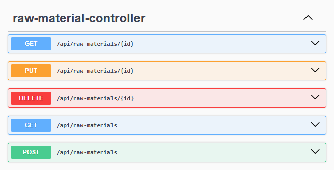
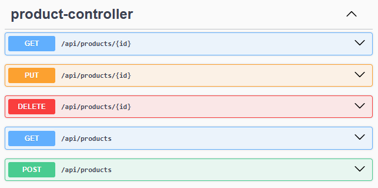
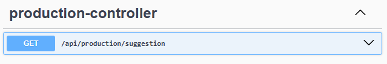

# PROJEDATA BACKEND

API REST para gerenciamento de **produtos** e **matérias-primas**, com foco em controle de produção e estoque.

---

## 🚀 Tecnologias Utilizadas

- **Java 21**  
  Aproveitando as melhorias mais recentes de performance e linguagem.

- **Spring Boot 3.4.x**  
  Framework base para criação da API.

- **Spring Data JPA**  
  Abstração para persistência e acesso a dados.

- **PostgreSQL**  
  Banco de dados relacional.

- **Flyway**  
  Versionamento e controle de migrations do banco de dados.

- **SpringDoc OpenAPI (Swagger)**  
  Documentação interativa da API.

---

## 📋 Pré-requisitos

Antes de rodar o projeto, você precisa ter instalado:

- **JDK 21**
- **PostgreSQL** (local ou via Docker)
- **Maven 3.9+**  
  _(Opcional caso utilize o wrapper `./mvnw`)_

---

## ⚙️ Configuração do Ambiente

Este projeto utiliza **variáveis de ambiente** para garantir mais segurança e flexibilidade.

Antes de iniciar a aplicação, configure as seguintes variáveis no seu sistema operacional ou na IDE:

| Variável      | Descrição                       | Exemplo                                    |
| ------------- | ------------------------------- | ------------------------------------------ |
| `DB_URL`      | URL de conexão com o PostgreSQL | `jdbc:postgresql://localhost:5432/nome_db` |
| `DB_USER`     | Usuário do banco de dados       | `meu_usuario`                              |
| `DB_PASSWORD` | Senha do banco de dados         | `sua_senha_secreta`                        |
| `IP`          | Endereço do front end           | `http://localhost:3000`                    |

> ⚠️ **Observação:** o prefixo `postgres.` do driver já é fixo na configuração do projeto.

---

## ▶️ Como Rodar o Projeto

```bash
git clone https://github.com/seu-usuario/projedata-backend.git
cd projedata-backend
```

Configure as variáveis de ambiente mencionadas acima.

Compile e rode a aplicação:

```bash
./mvnw spring-boot:run
```

A aplicação subirá por padrão na porta 8080. O Flyway irá validar o esquema e aplicar as migrations automaticamente.

## 🐳 Rodando com Docker

Como o projeto já possui um `Dockerfile` otimizado (multi-stage build), você pode subir a aplicação sem precisar instalar o Java localmente.

### 1. Build da Imagem

Na raiz do projeto, execute:

```bash
docker build -t projedata-backend .
```

### 2. Execução do Container

Para rodar o container passando as variáveis de ambiente necessárias:

```bash
docker run -p 8080:8080 \
  -e DB_URL=jdbc:postgresql://host.docker.internal:5432/nome_db \
  -e DB_USER=seu_usuario \
  -e DB_PASSWORD=sua_senha \
  -e IP=endereco_front_end \
  projedata-backend
```

Dica: O host.docker.internal é usado para o container conseguir acessar o banco que está rodando no seu Windows/Mac local.

## 🛣️ Guia de Endpoints da API

Abaixo estão listados todos os recursos disponíveis na aplicação, organizados por domínio.

---

### 📦 Matérias-Primas

**Base URL:** `/api/raw-materials`

| Método     | Endpoint | Descrição                                               |
| :--------- | :------- | :------------------------------------------------------ |
| **GET**    | `/`      | Lista todas as matérias-primas cadastradas.             |
| **POST**   | `/`      | Cadastra uma nova matéria-prima no sistema.             |
| **GET**    | `/{id}`  | Retorna os detalhes específicos de uma matéria-prima.   |
| **PUT**    | `/{id}`  | Atualiza as informações de uma matéria-prima existente. |
| **DELETE** | `/{id}`  | Remove permanentemente uma matéria-prima.               |

## 

### 🍏 Produtos

**Base URL:** `/api/products`

| Método     | Endpoint | Descrição                                     |
| :--------- | :------- | :-------------------------------------------- |
| **GET**    | `/`      | Lista todos os produtos disponíveis.          |
| **POST**   | `/`      | Cadastra um novo produto final.               |
| **GET**    | `/{id}`  | Retorna os detalhes de um produto específico. |
| **PUT**    | `/{id}`  | Atualiza os dados de um produto existente.    |
| **DELETE** | `/{id}`  | Remove um produto do catálogo.                |

## 

### ⚙️ Produção

**Base URL:** `/api/production`

| Método  | Endpoint      | Descrição                                                      |
| :------ | :------------ | :------------------------------------------------------------- |
| **GET** | `/suggestion` | Analisa o estoque e retorna sugestões de produção inteligente. |

## 

## 🛠 Como testar os endpoints?

Você pode utilizar ferramentas como **Postman**, **Insomnia** ou a própria documentação interativa gerada pelo Swagger:

1. Certifique-se de que a aplicação está rodando.
2. Acesse: [http://localhost:8080/swagger-ui/index.html](http://localhost:8080/swagger-ui/index.html)
3. Utilize os botões **"Try it out"** para enviar requisições reais para a API.

🔗 http://localhost:8080/swagger-ui/index.html

---
